# **Rock, Paper, Scissors, Lizard, Spock Game**
## **Portfolio Project 2**

### **JavaScript  Essentials**
### Diploma in Software Development (E-commerce Applications)  
### **Link to live site - https://lew94.github.io/RPSLS-Game/**
 

## **Aim**

The site’s users want to play an online game that has elements of chance.  
The site’s goal is to provide a challenging game with increasing levels of difficulty to entertain online users.

**Potential features to include:**

- Pattern matching functionality
- A limited number of tries before the game is over
- A score tracking system
- The ability to play against the computer

**Main Technologies**
Required: JavaScript, HTML, CSS

 

# Rock Paper Scissors Lizard Spock
 

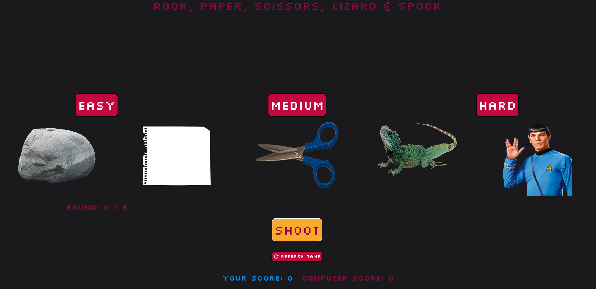

 

## **Initial Steps**
---

 

## Brainstorm:

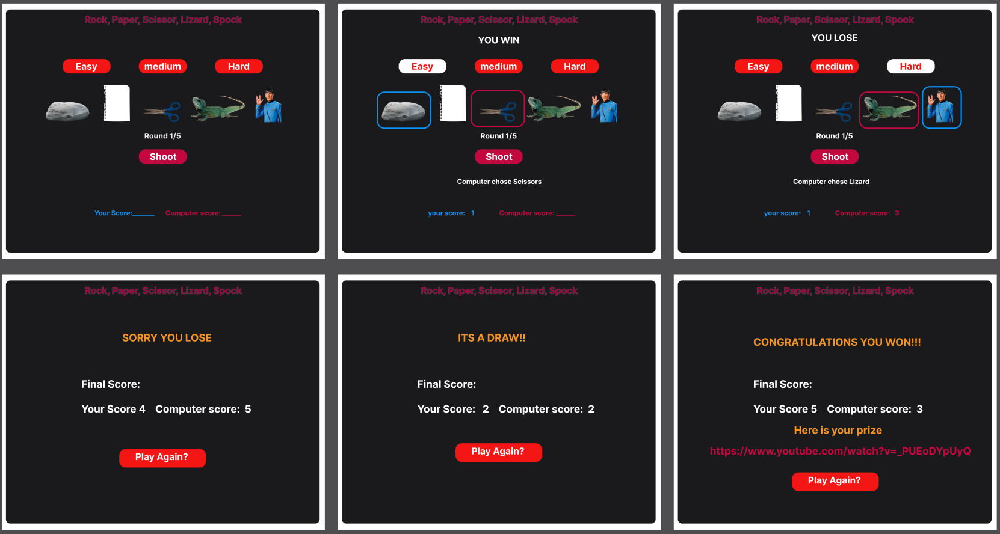

Above is my Figma webpage design mock up, This design was create before any production would start, So the end production may be different to the final image. I wanted to create a visual representation of what i wanted my game to look like, but also be able to adjust when needed.

There was many elements I had to think about that would be needed for this site to run and 
actually work. The logic would be the hard part, Trying to think of how my system would take users input and run logic and then output results.

[If you would like to see my rFigma page for this project click this link [Figma page]](https://www.figma.com/file/KgqV7LHKMIMj1lMJMvJat2/RPSLS-Game?node-id=0%3A1 "Figma  Work")

So for the site to work 
- The user must choose a game difficulty,
- The user must choose a game item
- The user then needs to run the game

- The system then needs to take these inputs
- THe system then needs to run the right variables to get an outcome
- The system then needs to output the results to the user

 

## **Layout**
---
 

## Final Design

The final design:

- 1 page
    - 3 buttons for game difficulty
    - Round outcome message (default - hidden)
    - Computer game chosen game item message (default - hidden)
    - Winner prize link (default - hidden)
    - 5 image buttons for game items
    - 5 image buttons for game items
    - Round counter
    - Shoot button to run the rounds
    - Refresh game button
    - User & computer current score

     

The site will include media :

 - images for game pieces

 Website should adjust when on different screen sizes:
 
- Monitors
- Laptops
- phones

 

## Fonts:
For my website I have decided to use these for my font family:

- Silkscreen

I wanted to use Silkscreen as I feel it works as an 8bit themed text, Adding to the game feel. I paired it with a Black/ Red/ Blue and white color scheme, for that old school retro vibe.

---

## **Web Page's layout Detail and Logic**

---
 

## Features:
 

This Site includes:
- Hidden message

The site has a few hidden messages, these are here for different game outcomes, where they will print the round outcome, the computer game item and finally a hidden message to print the result of the game win/lose/Draw and if win the link to the prize is printed.

- Game modes

The site has different game mode to increase the difficulty.

    -easyMode - system gets random number from 1-12 if = 10 then the user draws, else if number is >10 the user loses else the user wins

    -mediumMode - system get random number from 1-10 if = 10 then draw, else if number % 2 = 0 then user lost else user wins

    -hardMode - system get random number from 1-10 if = 10 draw, else if number >=7 user wins else user loses
After each round the Round counter is increased by 1 and the user and pc score is increased by 1 depending on the outcome of the round. The system then check if round count is = 5 if not loop round till round = 5. where the hidden messages are printed.

- Shoot button

This button checks first if user selected game mode and game item and if not the game wont stat, if true the system disables the game mode button to stop the user changing mid game.
Then when clicked it runs its through the gameMode logic.

- Refresh game button

This button reloads the page letting the user start the game again

## Frameworks:

**Bootstrap**

I am using Bootstrap, for its built-in grid system, I found it very helpful to position and layout the items on the page. Bootstrap comes with a lot of preset features that allowed easy and fast modification to the elements.
 
 

## Media:

**Image**

All mages used for this game was provided from https://www.pngegg.com/

 

## Inputs & Outputs:

## **Build and host**
---

All the code was built using Visual studio web IDE, Which was hosted on GitPod. [Code was often committed and pushed to my Github repository.](https://github.com/lew94/RPSLS-Game "Github Repository") The site was deployed using Github Pages, which can be found here: https://lew94.github.io/RPSLS-Game/ for the latest view.

 

## **Testing and validating**

So for the site to be successful the game would need to run but most important the game must produce teh right outputs based ont he user interactions. Below are images of the tests ran on the site.

- Test 1 select game mode but not game item and run game, Game shouldn't not run and error message output:
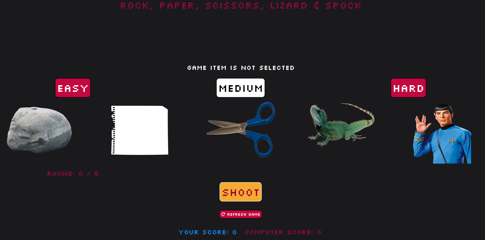
- Test 2 select game item but not game mode and run game, Game shouldn't not run and error message output:
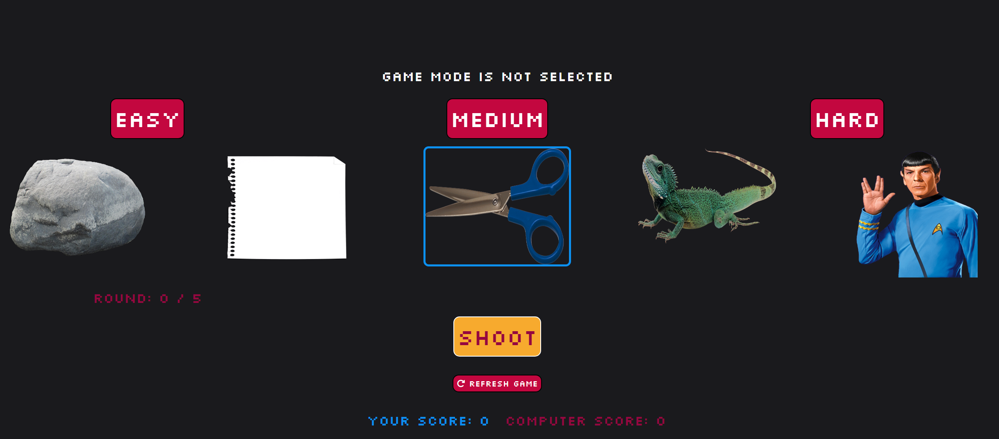
- Test 3 Win game, system should output victory message based on user and computer score after round 5:
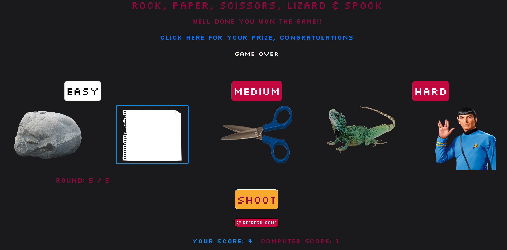
- Test 4 Win game, system should output lose message based on user and computer score after round 5:
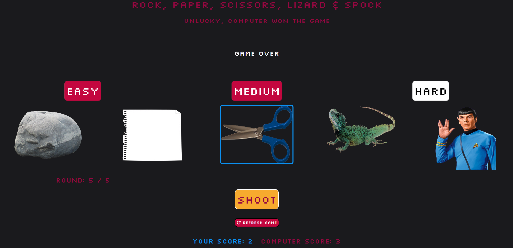
- Test 5 Win game, system should output draw message based on user and computer score after round 5:
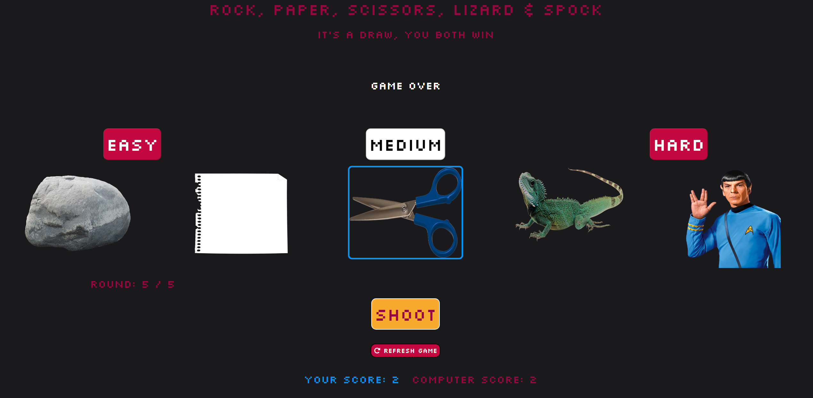

## Validator:

All the JavaScript, HTML and CC was ran through validator's to find any errors or warnings the results are below:

**CSS**

The .css page was copied and pasted into the direct input section of the validator, once it ran it presented the results. No errors found
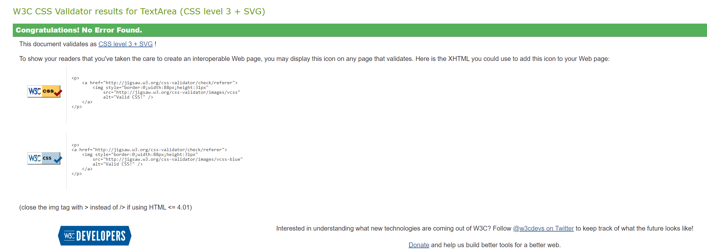
**HTML**

Each HTML page was copied and put in the direct input and run one by one, the results was then presented. All HTML page were successful with no errors or warnings. 

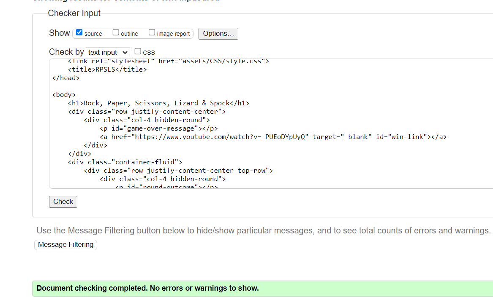

**Js**

The code for the JavaScript passed the validator, errors did arse but was due to longer line characters.

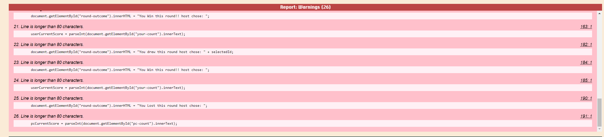
 

## LightHouse:

Lighthouse is a feature as part of the DevTools browser tools. Lighthouse is an automated tool for improving the quality of web pages by check the responsiveness and quality of the pages and how the load. After the test runs you are presented with score and report. I ran Lighthouse on my site and received a medium-high score, it showed me area I needed to improve, mainly the image format and font load times take a while so I needed to included font-switch. After changing the images to Webp and adding a font-switch I gained a much better score.

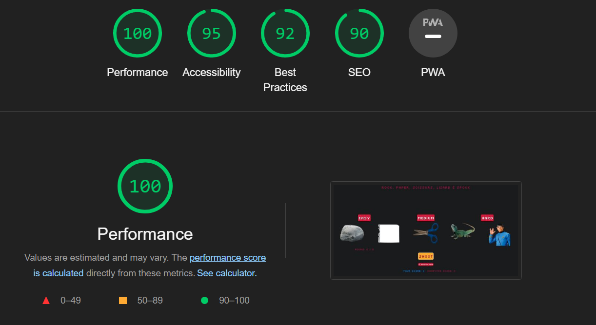

 

## Problems/ Bugs:

Currently there are no problems or bugs on the site, that I am aware of. The site is small and has been heavily tested and no issues are currently causing any issue.

 

## **Resources**
---
I would like to credit all the site that I used in the building of this site.

## Images:

**Pngegg -** https://www.pngegg.com/

 

## Fonts:

**Google Fonts -** https://fonts.google.com/

 
## IDE and Hosting sites:

**Visual Studio Web -** https://code.visualstudio.com/docs/editor/vscode-web

**Github -** https://github.com/

**Gitpod -** https://www.gitpod.io/

**Github Pages -** https://pages.github.com/

 

## **Acknowledgements**
---
 

I just want to use this space to acknowledge all those that helped me to complete this site and this assignment.

I want to thank all those at Code Institute all the facilitators and mentors that helped answer my questions
and provided constructive feedback. I wouldn't be able to complete this project without there help.

I also want to thank all those on the slack chatroom that help point me in the right direction or help provided answers to my question's.

A few sites that I want to acknowledge for all there advice, help and all-around knowledge:

**Stack Overflow -** https://stackoverflow.com/

**Bootstrap -** https://getbootstrap.com/

**W3schools -** https://www.w3schools.com/

**Code Institute -** https://codeinstitute.net/ie/

Without all these resources I would not be able to complete my task and have it look so good, So a special thank you to all those involved.
